# GP-News

GP-News builds an AI-assisted market and geopolitical news briefing, renders it as an HTML email, and can send it through Amazon SES.

## What it does

- Fetches market data from Yahoo Finance chart endpoints.
- Fetches article metadata from NewsData.io.
- Extracts article content, deduplicates links, and filters failed extractions.
- Uses an LLM to summarize articles, review selections, and compose the final briefing.
- Renders the briefing with the React Email template in `email/template`.
- Sends the rendered email through Amazon SES.

## Dependencies

- Go
- TypeScript and pnpm
- NewsData.io API key when fetching fresh news
- LLM model and API key
- AWS credentials

## Configuration

Local runs load `.env` by default. Set `ENVIRONMENT=prod` to skip `.env` loading.

Common variables:

- `NEWS_DATA_API_KEY`: required when `FRESH_FROM=fetching`.
- `BASE_URL`: LLM API base URL. Defaults to `https://api.openai.com/v1`.
- `LLM_API_KEY`: LLM API key.
- `MODEL`: LLM model name.
- `FRESH_FROM`: where to start fresh work. Allowed values are `fetching`, `summarization`, `review`, `briefing`, and `cached`. Defaults to `fetching`.
- `CACHE_DIR`: cache and output directory. Defaults to `cache`.
- `PERSIST_DATA`: write intermediate JSON files for debugging. Defaults to `false`.
- `ENABLE_EMAIL_SENDING`: send through SES after rendering. Defaults to `true`; set it to `false` for render-only local runs.
- `EMAIL_FROM`: SES sender address, required when email sending is enabled.
- `EMAIL_TO`: comma-separated SES recipients, required when email sending is enabled.
- `AWS_SES_REGION`: optional SES region override.
- `BRIEFING_HISTORY_TABLE`: optional DynamoDB table for suppressing recently selected stories.

OpenRouter-specific variables:

- `LLM_PROVIDER_IGNORE`: comma-separated provider slugs to avoid.
- `LLM_THINKING_LEVEL`: sent as reasoning effort. Defaults to `medium`.
- `LLM_MAX_COMPLETION_TOKENS`: defaults to `0`; leave uncapped unless a hard limit is needed.

## Makefile

```sh
make run
```

Check `Makefile` for other commands.

## Module layout

- `cmd/local`: local entrypoint.
- `cmd/lambda`: AWS Lambda entrypoint.
- `internal/app`: configuration, orchestration, logging, and pipeline wiring.
- `internal/history`: optional DynamoDB history dedupe.
- `ingest`: market/news retrieval, article extraction, and source normalization.
- `briefing`: LLM processing, review, final briefing generation, schemas, and cache helpers.
- `email`: HTML rendering and SES sending.
- `email/template`: pnpm package containing React Email source and exported template.

## Briefing pipeline

```mermaid
flowchart TD
    A["cmd/local or cmd/lambda"] --> B["Load environment and validate config"]
    B --> C{"FRESH_FROM"}

    C -->|cached| CACHED["Load final_briefing.json"]
    C -->|briefing| FINAL_INPUT_CACHE["Load final_briefing_input.json"]
    C -->|review| CACHE_DATA["Load market_values.json and news_data.json"]
    C -->|summarization| CACHE_DATA
    C -->|fetching| RETRIEVE["Retrieve fresh market and news data"]

    subgraph Retrieval["Fresh retrieval fan-out and fan-in"]
        RETRIEVE --> RETRIEVE_FANOUT{"fan out"}
        RETRIEVE_FANOUT --> YAHOO["Yahoo Finance market snapshot"]
        RETRIEVE_FANOUT --> NEWS_CATEGORY["NewsData category buckets"]
        RETRIEVE_FANOUT --> NEWS_REGION["NewsData region buckets"]

        YAHOO --> YAHOO_FANOUT["fan out per instrument"]
        YAHOO_FANOUT --> YAHOO_CHART["Fetch 5-day chart data"]
        YAHOO_CHART --> YAHOO_FANIN["fan in market values"]

        NEWS_CATEGORY --> NEWS_FANIN["fan in article buckets"]
        NEWS_REGION --> NEWS_FANIN
        NEWS_FANIN --> CONTENT_LINKS["Collect unique article links"]
        CONTENT_LINKS --> CONTENT_FANOUT["fan out content extraction"]
        CONTENT_FANOUT --> CONTENT_FETCH["Fetch, read, and convert article pages"]
        CONTENT_FETCH --> CONTENT_FANIN["fan in extracted content"]

        YAHOO_FANIN --> RETRIEVE_JOIN["Join market values with article buckets"]
        CONTENT_FANIN --> RETRIEVE_JOIN
        RETRIEVE_JOIN --> RAW_CACHE{"PERSIST_DATA?"}
        RAW_CACHE -->|yes| STORE_RAW["Write market_values.json and news_data.json"]
        RAW_CACHE -->|no| RAW_READY["Raw input ready"]
        STORE_RAW --> RAW_READY
    end

    CACHE_DATA --> BUILD_INPUT["Build BriefingAgentInput"]
    RAW_READY --> BUILD_INPUT
    BUILD_INPUT --> NORMALIZE["Build market inputs and de-dupe articles by link"]
    NORMALIZE --> EXTRACTED_CACHE{"PERSIST_DATA?"}
    EXTRACTED_CACHE -->|yes| STORE_EXTRACTED["Write extracted_news.json"]
    EXTRACTED_CACHE -->|no| INPUT_READY["BriefingAgentInput ready"]
    STORE_EXTRACTED --> INPUT_READY
    INPUT_READY --> DEDUPE_GATE{"History table set and stage allows dedupe?"}

    subgraph History["Briefing history dedupe"]
        DEDUPE_GATE -->|yes| QUERY_HISTORY["Query recent selected news from DynamoDB"]
        QUERY_HISTORY --> HISTORY_FANOUT["fan out semantic duplicate checks"]
        HISTORY_FANOUT --> HISTORY_LLM["LLM compares current article to recent history"]
        HISTORY_LLM --> HISTORY_FANIN["fan in duplicate decisions"]
        HISTORY_FANIN --> FILTER_HISTORY["Remove duplicate article IDs"]
    end

    DEDUPE_GATE -->|no| READY_FOR_LLM["Input ready for LLM pipeline"]
    FILTER_HISTORY --> READY_FOR_LLM

    READY_FOR_LLM --> PROCESS_GATE{"FRESH_FROM=review?"}
    PROCESS_GATE -->|yes| LOAD_PROCESSED["Load processed_news.json"]
    PROCESS_GATE -->|no| FILTER_VALID["Filter articles with extraction errors"]

    subgraph Briefing["LLM briefing generation"]
        FILTER_VALID --> PROCESS_FANOUT["fan out per-article structured calls"]
        PROCESS_FANOUT --> PROCESS_LLM["Summarize, score, and first-pass select"]
        PROCESS_LLM --> PROCESS_FANIN["fan in ProcessedNews by article ID"]
        PROCESS_FANIN --> PROCESSED_CACHE{"PERSIST_DATA?"}
        PROCESSED_CACHE -->|yes| STORE_PROCESSED["Write processed_news.json"]
        PROCESSED_CACHE -->|no| PROCESSED_READY["Processed news ready"]
        STORE_PROCESSED --> PROCESSED_READY
        LOAD_PROCESSED --> PROCESSED_READY

        PROCESSED_READY --> REVIEW_STATE["Create review state"]
        REVIEW_STATE --> REVIEW_PROMPT["Build review-agent prompt"]
        REVIEW_PROMPT --> REVIEW_LLM["Review agent"]
        REVIEW_LLM -->|get_article_context| ARTICLE_CONTEXT["Return metadata, ProcessedNews, optional full content"]
        ARTICLE_CONTEXT --> REVIEW_LLM
        REVIEW_LLM -->|review_article| REVIEW_DECISION["Promote, demote, reprioritize, correct, or annotate"]
        REVIEW_DECISION --> REVIEW_LLM
        REVIEW_LLM -->|finish_review| REVIEW_DONE["Persist review summary"]
        REVIEW_DONE --> FINAL_INPUT["Build final BriefingInput"]
        FINAL_INPUT --> FINAL_CACHE{"PERSIST_DATA?"}
        FINAL_CACHE -->|yes| STORE_FINAL_INPUT["Write final_briefing_input.json"]
        FINAL_CACHE -->|no| FINAL_READY["Final input ready"]
        STORE_FINAL_INPUT --> FINAL_READY
        FINAL_INPUT_CACHE --> FINAL_READY

        FINAL_READY --> COMPOSE_LLM["Final structured briefing composer"]
        COMPOSE_LLM --> DRAFT_CACHE{"PERSIST_DATA?"}
        DRAFT_CACHE -->|yes| STORE_DRAFT["Write final_briefing_draft.json"]
        DRAFT_CACHE -->|no| MERGE_MARKETS["Merge deterministic market snapshot with model drivers"]
        STORE_DRAFT --> MERGE_MARKETS
        MERGE_MARKETS --> COUNT_GATE{"5 to 15 full news cards?"}
        COUNT_GATE -->|no, first failure| RETRY_FINAL["Retry with count correction"]
        RETRY_FINAL --> COMPOSE_LLM
        COUNT_GATE -->|no, retry failed| ERROR["Return error"]
        COUNT_GATE -->|yes| FINAL_EMAIL["BriefingEmail"]
        FINAL_EMAIL --> FINAL_OUTPUT_CACHE{"PERSIST_DATA?"}
        FINAL_OUTPUT_CACHE -->|yes| STORE_FINAL_EMAIL["Write final_briefing.json"]
        FINAL_OUTPUT_CACHE -->|no| EMAIL_READY["Email data ready"]
        STORE_FINAL_EMAIL --> EMAIL_READY
        CACHED --> EMAIL_READY
    end

    subgraph Delivery["Rendering and delivery"]
        EMAIL_READY --> TEMPLATE["Use exported React Email template"]
        TEMPLATE --> RENDER["Render HTML to briefing_email.html"]
        RENDER --> SEND_GATE{"ENABLE_EMAIL_SENDING?"}
        SEND_GATE -->|yes| SES["Send rendered HTML with Amazon SES"]
        SEND_GATE -->|no| DONE["Done"]
        SES --> DONE
    end

    DONE --> HISTORY_WRITE_GATE{"History table set, stage allows history, and selected news available?"}
    HISTORY_WRITE_GATE -->|yes| HISTORY_WRITE["Write selected news records to DynamoDB with TTL"]
    HISTORY_WRITE_GATE -->|no| RESULT["Return app result"]
    HISTORY_WRITE --> RESULT
```


