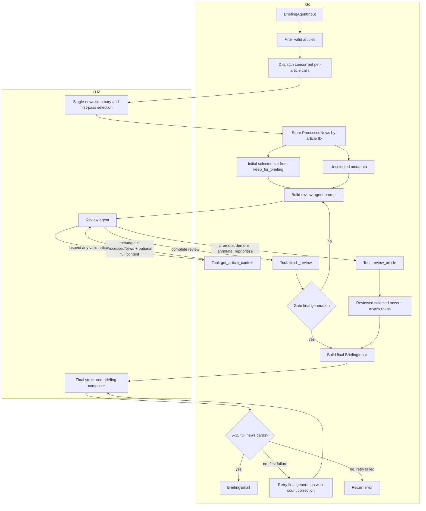

# Briefing Package

## Briefing Generation Process

The generation pipeline is implemented in `GenerateBriefing`.

Graph key:
- **Go code** filters errored articles, stores immutable first-pass analysis, manages durable review decisions, serves tools, enforces `finish_review`, and decides when final generation is allowed.
- **LLM calls** summarize/analyze individual articles once, choose review-agent tool calls, and compose the final `BriefingEmail`.

## File Layout

- `generate.go`: public generator entry points, OpenAI/OpenRouter client setup, structured JSON helper, and shared chat request options.
- `brief.go`: final briefing input assembly and `BriefingEmail` structured composition prompt.
- `process.go`: concurrent per-article processing and the single-news processing prompt.
- `review.go`: review-agent state, review loop, tool definitions, tool handlers, final briefing gate, and review prompt.
- `process_schema.go`: article input, single-news input, `ProcessedNews`, and its JSON schema helper.
- `briefing_schema.go`: market input, final briefing input/output types, and the shared schema reflector.

1. Fetch and normalize data
   - Market data is converted into `MarketInput` values before entering this package, including current levels, computed daily change when available, and recent 5-day close history for comparison context.
   - News buckets are deduplicated by link and converted into `ArticleInput` values before entering this package.
   - Articles with a non-empty `ExtractionError` are excluded completely before any model call. They are not summarized, listed, tool-accessible, or visible to the agent.

2. Process each valid news entry
   - Each valid article is sent to the model in its own structured JSON call.
   - These calls run concurrently with a bounded first-pass LLM concurrency limit.
   - Each LLM chat completion is bounded by a per-request timeout, so one provider call cannot block the entire briefing indefinitely.
   - The model returns one `ProcessedNews` object per article, including summary, relevance analysis, market impact, confidence, and `keep_for_briefing`.
   - Structured calls use `response_format: json_schema` with `strict=true` and also set `structured_outputs=true`; schema adherence depends on the configured model/backend actually enforcing structured outputs.
   - All OpenRouter chat requests set `provider.require_parameters=true`.
   - If a first-pass news item still fails after the structured-call retry behavior, Go logs and excludes only that article; the rest of the briefing continues.
   - OpenRouter requests may ignore unreliable providers with comma-separated slugs in `LLM_PROVIDER_IGNORE` (for example, `akashml,morph` for `deepseek/deepseek-v4-flash` structured outputs).
   - OpenRouter requests include `X-OpenRouter-Experimental-Metadata: enabled`; decode failures log the selected provider and router metadata when returned.
   - Leave `LLM_MAX_COMPLETION_TOKENS=0` unless a hard cap is needed. DeepSeek can spend hundreds of reasoning tokens before emitting small JSON, so low caps can return empty content.
   - Only entries with `keep_for_briefing=true` become initially selected news.

3. Run the review agent
   - The agent receives:
     - the market snapshot with current levels and recent comparison history
     - reviewed summaries for initially selected `ProcessedNews`
     - only title/link/source/bucket metadata for unselected valid news
   - The agent cannot generate the final briefing during this phase.
   - The review phase uses strict tool schemas, but does not request the final briefing JSON schema.
   - Ordinary assistant prose is rejected with a follow-up instruction to continue using tool calls only.
   - Final generation is blocked in code until the agent successfully calls `finish_review`.
   - Review decisions are durable: the agent can promote, demote, reprioritize, correct, or add context without mutating the original `ProcessedNews`.

4. Agent tools
   - `get_article_context`
     - Returns metadata and initial `ProcessedNews` for any valid article.
     - Returns full extracted content when `include_full_content=true`.
     - Does not mutate review state.
   - `review_article`
     - Persists a durable review decision for any valid article.
     - Adds or keeps an article when `include_for_briefing=true`.
     - Removes or demotes an article when `include_for_briefing=false`, including articles initially selected by the first-pass model.
     - Stores `priority_score`, `review_note`, `corrections`, and `additional_context` for final composition.
   - `finish_review`
     - Completes review only when `article_ids` exactly matches all valid article IDs, including selected and unselected entries.
     - Persists `selection_rationale` and `global_context` for final composition.
     - This is the code-level gate that allows final generation.
     - If multiple tools are returned in the same model response, `review_article` calls are applied before `finish_review` is evaluated.

5. Generate final briefing
   - After review is complete, the final model call receives market data, selected `ReviewedNews`, and `ReviewSummary`.
   - Selected reviewed news is ordered by descending `priority_score`.
   - Full article content is not passed to final generation by default; only compact review notes, corrections, and additional context are carried forward.
   - The model generates the final email `subject`; the schema requires it to be briefing-specific and not a generic desk name.
   - The model generates `market_drivers` keyed by supplied market IDs, but does not generate the final `market_snapshot`.
   - Go assembles the public `market_snapshot` deterministically from supplied market data, preserving asset, level, `daily_change`, timestamp, source, and input order within each category.
   - Missing market drivers use a neutral fallback; drivers for unknown market IDs are ignored with a warning.
   - Final composition has its own longer bounded chat timeout because the reviewed-news handoff is much larger than individual first-pass article calls.
   - The final result must contain 5 to 15 total full news cards across all `top_news_by_topic` arrays combined. If the model returns a count outside that range, generation is retried once and then fails loudly.
   - Full news cards and regional radar items carry their own `sources` label/url objects; there is no separate top-level sources section.
   - This phase also uses the strict JSON schema response format, with an internal `BriefingEmailDraft` schema.
   - It returns the current `BriefingEmail` JSON shape used by the email template. The email template renders market `daily_change` inline in the existing Market Snapshot section.
   - After this package returns `BriefingEmail`, `main.go` renders the pre-exported React Email HTML template and writes `cache/briefing_email.html`.
   - The old post-generation verification step is no longer part of the runtime path.

## OpenRouter Notes

- `LLM_PROVIDER_IGNORE` is a comma-separated list, not a single provider value. The current known-bad list for `deepseek/deepseek-v4-flash` structured output enforcement is `akashml,morph`.
- `LLM_THINKING_LEVEL` is sent as `reasoning.effort`; reasoning output is excluded from responses with `reasoning.exclude=true`.
- The decoder intentionally uses `DisallowUnknownFields`. Provider output that adds fields such as `include` or `include_in_briefing` should fail loudly instead of being coerced into the briefing schema.
